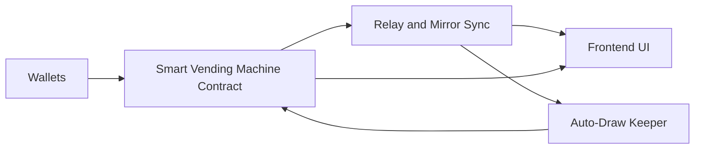

# DAOwyn Lottery: Provably-Fair Prize Pool (MVP)

A production-minded decentralized prize pool built on Hedera that delivers provably-fair draws, automatic refunds for overpayments, and an automated draw flow. I scoped and shipped this MVP solo: I defined the product, selected the architecture, implemented the core Solidity and TypeScript logic, and built automation for end-to-end draws.

## Why this matters

This product combines a simple, low-friction user experience with auditable randomness and a minimal server surface for canonical state. The result is a prize product that is easy for users to use, easy for operators to verify, and straightforward to audit.

## Key features

- **Smart Vending Machine:** accepts variable HBAR entries, keeps only what is needed to reach the pool target, and automatically refunds the overage with a push-or-credit model (user protection).
- **Two-stage draw:** Filling → Ready → Drawing lifecycle separates final deposits from payout to prevent race conditions and front-running.
- **Verifiable randomness:** uses the Hedera PRNG precompile for a provably-fair seed used to select the winner.
- **Frontend product UI:** dark/light mode, real-time pool stats, participant counts, and a clear deposit UX.
- **Automated draws:** keeper system watches canonical state and triggers draws automatically when the pool is ready.
- **Minimal relay + mirror sync:** lightweight server that stores canonical snapshots and transaction mappings to simplify verification.
- **Production safety:** reentrancy guards, net-balance readiness checks, and graceful refund handling.
- **Fee model:** protocol fee is 2.5% (implemented in contract).

## Architecture — visual summary



## How it works (high level)

- Entry: Users deposit HBAR via the UI or directly to the contract. The contract acts like a Smart Vending Machine: it accepts variable amounts, keeps only what is required to fill the pool target, and refunds any overage either immediately or as a credited balance for later withdrawal. See the entry logic in the contract: [`chain/contracts/Lottery.sol`](chain/contracts/Lottery.sol:1). Each wallet's chance to win is proportional to the amount it contributed in that round — for example, a wallet that contributed 5 HBAR in a 10 HBAR pool has a 50% chance to be selected.
 
- Readiness: The contract calculates a net balance that excludes pending refunds; when net balance >= pool target the contract flips to Ready and emits PoolFilled. The keeper watches the relay/mirror for that canonical snapshot and initiates the draw.

- Draw: The keeper calls the contract trigger function, the contract requests a bytes32 seed from the Hedera PRNG precompile, computes the winning index from that seed, and pays the winner and protocol fee. See the PRNG call and selection in the contract: [`chain/contracts/Lottery.sol`](chain/contracts/Lottery.sol:211).

- Verification: The draw transaction ID and the relay snapshot provide everything needed to independently verify the winner (see Verification section below).

## How to run locally (minimal)

Prerequisites: Node.js (16+), npm. Commands assume you are at the repository root.

1) Chain (compile & optional local node)

```bash
cd chain
npm install
npm run compile    # compiles contracts and syncs ABI
# optional: run a local Hardhat node
npx hardhat node
# optional: deploy to local node
npx hardhat run scripts/deploy.ts --network localhost
```

2) Web (frontend + keeper/relay)

```bash
cd ../web
npm install
# create .env.local with your network and keys (see web/.env.local for example)
npm run dev
```

Developer notes: contract source is at [`chain/contracts/Lottery.sol`](chain/contracts/Lottery.sol:1); keeper and auto-draw server live under [`web/src/server/autoDraw.ts`](web/src/server/autoDraw.ts:1); mirror sync helpers in [`web/src/lib/mirror.ts`](web/src/lib/mirror.ts:1); live UI components under [`web/src/components/LivePanel.tsx`](web/src/components/LivePanel.tsx:1).

## Verification — how to independently verify a draw

1. Obtain the draw transaction ID (TXID). The UI surfaces this after a draw, or it can be fetched from a Hedera explorer.

2. Retrieve the canonical participant snapshot for that round from the project's relay/mirror. The repo includes a snapshot API path used by the UI: [`web/src/app/api/snapshot/route.ts`](web/src/app/api/snapshot/route.ts:1).

3. Extract the PRNG seed used in the draw. The contract requests a bytes32 seed from the Hedera PRNG precompile during triggerDraw; that returned seed is visible in the transaction trace or captured by the relay. See the seed request and selection logic in the contract: [`chain/contracts/Lottery.sol`](chain/contracts/Lottery.sol:224).

4. Recompute the winner:

- Convert the seed to an unsigned integer, compute r = uint256(seed) % totalStake, then iterate the recorded participant list summing each participant's stake. The winner is the first participant where the running cumulative stake exceeds r. This weighted-selection algorithm (by stake) is implemented in the contract's triggerDraw logic: [`chain/contracts/Lottery.sol`](chain/contracts/Lottery.sol:226).

5. Confirm that the recomputed participant address matches the WinnerPicked event recorded in the transaction logs.

Notes: the provided relay is built to make verification simple for non-technical reviewers — it preserves round snapshots and maps tx IDs to the recorded seed and participant list so anyone can re-run the index calculation and confirm the result.

## My role and contributions

- **Product & Engineering Owner**
  - I conceived and built the entire MVP end-to-end — including the smart contract, frontend UI, backend relay, and auto-draw keeper — to demonstrate a provably fair decentralized prize pool on Hedera.

- **Architecture & System Design**
  - I designed a two-stage draw lifecycle to eliminate race conditions.
  - I integrated Hedera's PRNG system contract to enable on-chain verifiable randomness.
  - I built the "Smart Vending Machine" entry mechanism that dynamically handles pool fill logic and auto-refunds any overage.

- **Smart Contract Development**
  - I authored the complete Solidity contract, implementing fairness safeguards, refund logic, and lifecycle stages.
  - I integrated PRNG logic and applied non-reentrancy protections.

- **Frontend & UX Development**
  - I developed the full user interface using TypeScript and React, including live pool tracking, entry interface, dark/light modes, and event feeds.
  - I implemented frontend logic for real-time sync and entry feedback.

- **Backend Relay & Automation**
  - I built the server-side relay and keeper service to watch Mirror nodes, normalize state, and trigger automated draws.
  - I ensured draw triggers and frontend state remain consistent and auditable.

- **End-to-End Testing & Iteration**
  - I personally tested all failure and edge cases: overfills, underfills, race conditions, refunds, and keeper-triggered draws.
  - I maintained ABI and contract stability across multiple iterations to protect frontend integration.

## Where to look in the codebase

- **Core contract**
  - Main implementation and draw logic: [`chain/contracts/Lottery.sol`](chain/contracts/Lottery.sol:1)
  - Hardhat config & deployment helpers: [`chain/hardhat.config.ts`](chain/hardhat.config.ts:1), [`chain/scripts/deploy.ts`](chain/scripts/deploy.ts:1)
  - Compiled ABI (used by the web client): [`web/src/abi/Lottery.json`](web/src/abi/Lottery.json:1)

- **Frontend (UI & components)**
  - Live pool panel and realtime UI: [`web/src/components/LivePanel.tsx`](web/src/components/LivePanel.tsx:1)
  - Entry form / deposit flow: [`web/src/components/EnterCard.tsx`](web/src/components/EnterCard.tsx:1)
  - Winner display & event feed: [`web/src/components/WinnerCard.tsx`](web/src/components/WinnerCard.tsx:1), [`web/src/components/ActivityFeed.tsx`](web/src/components/ActivityFeed.tsx:1)
  - Wallet and stats components: [`web/src/components/WalletStatsCard.tsx`](web/src/components/WalletStatsCard.tsx:1), [`web/src/components/WalletButton.tsx`](web/src/components/WalletButton.tsx:1)

- **Frontend state & hooks**
  - Shared context for round/participant data: [`web/src/context/LotteryDataContext.tsx`](web/src/context/LotteryDataContext.tsx:1)
  - Hooks for reading on-chain state and snapshots: [`web/src/hooks/useLotteryReads.ts`](web/src/hooks/useLotteryReads.ts:1), [`web/src/hooks/useLotterySnapshot.ts`](web/src/hooks/useLotterySnapshot.ts:1)
  - Hooks for submitting entries and triggering transactions: [`web/src/hooks/useLotteryWrites.ts`](web/src/hooks/useLotteryWrites.ts:1)
  - Event subscriptions used by the UI: [`web/src/hooks/useLotteryEvents.ts`](web/src/hooks/useLotteryEvents.ts:1)

- **Libs / integrations**
  - Mirror/relay helpers and snapshot mapping: [`web/src/lib/mirror.ts`](web/src/lib/mirror.ts:1)
  - Lightweight on-chain contract wrapper used by the client: [`web/src/lib/contracts/lottery.ts`](web/src/lib/contracts/lottery.ts:1)
  - Hedera utilities and config: [`web/src/lib/hedera.ts`](web/src/lib/hedera.ts:1)
  - Appkit / wallet initialization: [`web/src/lib/appkit-init.client.ts`](web/src/lib/appkit-init.client.ts:1)

- **Backend / automation (keeper & relay)**
  - Auto-draw keeper & relay that watches canonical snapshots and triggers draws: [`web/src/server/autoDraw.ts`](web/src/server/autoDraw.ts:1)
  - Minimal RPC/relay endpoints used by the UI and keeper: [`web/src/server/rpc.ts`](web/src/server/rpc.ts:1)
  - Snapshot API used for verifiable participant lists: [`web/src/app/api/snapshot/route.ts`](web/src/app/api/snapshot/route.ts:1)

## License

MIT