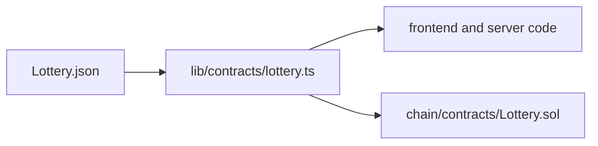

# web/src/abi — directory audit

This report describes every file in the [`web/src/abi:1`](web/src/abi:1) directory and how it interacts with the on-chain contract [`chain/contracts/Lottery.sol:1`](chain/contracts/Lottery.sol:1).

Directory-level interaction diagram:

Files

- [`web/src/abi/Lottery.json:1`](web/src/abi/Lottery.json:1)
  - Purpose: Compiled ABI for the Solidity contract [`chain/contracts/Lottery.sol:1`](chain/contracts/Lottery.sol:1). Provides the shape of events and functions (enter, triggerDraw, syncReady, debugUnits, getters, receive/fallback) used by the app.
  - Why it's here: Imported by [`web/src/lib/contracts/lottery.ts:30`](web/src/lib/contracts/lottery.ts:30) and consumed by viem/wagmi to create typed contract calls and decode event logs.
  - Notes: Regenerate this JSON after contract changes. The ABI is the authoritative mapping between frontend code and the on-chain contract ABI.