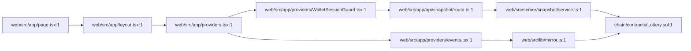

# web/src/app — directory audit

This report describes every file in the [`web/src/app:1`](web/src/app:1) directory and how it interacts with the on-chain contract [`chain/contracts/Lottery.sol:1`](chain/contracts/Lottery.sol:1).

Directory-level interaction diagram:

Files

- [`web/src/app/layout.tsx:1`](web/src/app/layout.tsx:1)
  - Purpose: Root Next.js layout; mounts client-only providers and the global header (WalletButton, NetworkBadge).
  - Why it's here: Top-level composition and to ensure providers initialize before page rendering.
  - Interaction with Lottery.sol: Indirect — it uses [`web/src/app/providers/events.tsx:1`](web/src/app/providers/events.tsx:1) to surface on-chain events and snapshot state derived from the contract.

- [`web/src/app/page.tsx:1`](web/src/app/page.tsx:1)
  - Purpose: Home route UI — composes WheelPanel, StatusCard, WinnerCard, EnterCard, and AdminCard; displays wallet connection state.
  - Why it's here: Primary entry for user interactions with the lottery frontend.
  - Interaction with Lottery.sol: Indirect — components use hooks and providers that read the snapshot and event feed sourced from the contract.

- [`web/src/app/providers.tsx:1`](web/src/app/providers.tsx:1)
  - Purpose: Wraps WagmiProvider, React-Query (QueryClientProvider), LotteryDataProvider and the WalletSessionGuard.
  - Why it's here: Central configuration of blockchain client, query caching, and app-level state.
  - Interaction with Lottery.sol: None directly; provides the contexts that other modules use to call/read the contract.

- [`web/src/app/providers/events.tsx:1`](web/src/app/providers/events.tsx:1)
  - Purpose: Maintains a merged event feed (history + polling), dedupes entries, and exposes refetch helpers to components.
  - Why it's here: To provide a live, de-duplicated event timeline to the UI without burdening components with Mirror logic.
  - Interaction with Lottery.sol: Direct dependency via [`web/src/lib/mirror.ts:1`](web/src/lib/mirror.ts:1) — the mirror helper computes ABI topics from the contract ABI and fetches logs for the lottery contract address.

- [`web/src/app/providers/WalletSessionGuard.tsx:1`](web/src/app/providers/WalletSessionGuard.tsx:1)
  - Purpose: Health guard that pings the server snapshot endpoint on focus and disconnects the wallet on failure.
  - Why it's here: Prevents user actions when server snapshot or RPC is down.
  - Interaction with Lottery.sol: Indirect — validates `/api/snapshot` which triggers the server to read contract state via [`web/src/server/snapshot/service.ts:1`](web/src/server/snapshot/service.ts:1).

- [`web/src/app/api/snapshot/route.ts:1`](web/src/app/api/snapshot/route.ts:1)
  - Purpose: Thin API route that returns the canonical snapshot JSON with ETag/304 semantics and rate-limits rebuild triggers.
  - Why it's here: Centralized server-side aggregation of on-chain state and Mirror events for clients.
  - Interaction with Lottery.sol: Primary server-side integration: invokes `buildSnapshot` which reads contract state (owner, participantCount, stage, debugUnits, pendingRefundsTotal, etc.) and aggregates events; see [`web/src/server/snapshot/service.ts:1`](web/src/server/snapshot/service.ts:1).

- [`web/src/app/globals.css:1`](web/src/app/globals.css:1)
  - Purpose: Global styles, theme variables and Tailwind imports.
  - Why it's here: Application styling; no contract interaction.

- [`web/src/app/favicon.ico:1`](web/src/app/favicon.ico:1)
  - Purpose: Static favicon asset for the site.
  - Why it's here: UI asset; no contract interaction.

Directory-level notes

- The app intentionally avoids heavy client-side contract parsing: event decoding and most on-chain reads happen server-side in [`web/src/server/snapshot/service.ts:1`](web/src/server/snapshot/service.ts:1) and mirror parsing in [`web/src/lib/mirror.ts:1`](web/src/lib/mirror.ts:1).
- Components and hooks (under [`web/src/components`](web/src/components:1) and [`web/src/hooks`](web/src/hooks:1)) consume the snapshot API and EventsProvider rather than parsing logs or calling contract methods directly.
- Snapshot service relies on the following contract functions/events: owner, isReadyForDraw, isDrawing, participantCount, stage, pendingRefundsTotal, POOL_TARGET, debugUnits, roundId and events EnteredPool, PoolFilled, WinnerPicked. See the canonical contract at [`chain/contracts/Lottery.sol:1`](chain/contracts/Lottery.sol:1).

End of report.