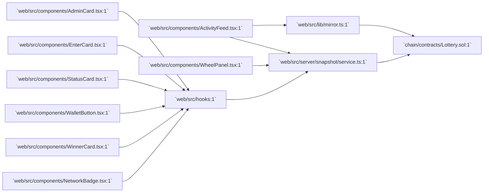

# web/src/components — directory audit

This report describes every file in the [`web/src/components:1`](web/src/components:1) directory and how it interacts with the on-chain contract [`chain/contracts/Lottery.sol:1`](chain/contracts/Lottery.sol:1).

Directory-level interaction diagram:

Files

- [`web/src/components/ActivityFeed.tsx:1`](web/src/components/ActivityFeed.tsx:1)
  - Purpose: Renders a searchable, filterable timeline of prize-pool events (EnteredPool, OverageRefunded, WinnerPicked) using the merged EventsProvider feed.
  - Why it's here: Provides users a readable activity stream and links to explorer URLs for transactions/accounts.
  - Interaction with Lottery.sol: Indirect — relies on [`web/src/lib/mirror.ts:1`](web/src/lib/mirror.ts:1) to fetch and decode Lottery contract events derived from the contract ABI.

- [`web/src/components/AdminCard.tsx:1`](web/src/components/AdminCard.tsx:1)
  - Purpose: Owner-only admin UI showing pool diagnostics (participantCount, balances, fee/prize previews) and a Trigger Draw action.
  - Why it's here: Lets the contract owner initiate the draw from the UI and inspect on-chain/state-derived diagnostics before acting.
  - Interaction with Lottery.sol: Direct (writes) — calls triggerDraw via the write hook (`useLotteryWrites`) and reads snapshot-derived on-chain values via `useLotteryReads` (server snapshot which queries the contract functions such as owner, stage, isReadyForDraw, participantCount, debugUnits).

- [`web/src/components/EnterCard.tsx:1`](web/src/components/EnterCard.tsx:1)
  - Purpose: User-facing form to enter the prize pool; displays remaining-to-target, refund previews and pending refunds.
  - Why it's here: Primary UX for participating in the lottery.
  - Interaction with Lottery.sol: Direct (writes) — uses `useEnterLottery` / `useLotteryWrites` to call the contract's `enter()` (handles sending HBAR). Reads gating info from `useLotteryReads` (snapshot).

- [`web/src/components/NetworkBadge.tsx:1`](web/src/components/NetworkBadge.tsx:1)
  - Purpose: Small UI badge showing current wallet chain and whether it matches Hedera Testnet.
  - Why it's here: Provides immediate network feedback for users.
  - Interaction with Lottery.sol: None directly — shows expected chain for safe interaction with the deployed Lottery contract.

- [`web/src/components/StatusCard.tsx:1`](web/src/components/StatusCard.tsx:1)
  - Purpose: Displays live pool status (net balance, progress to target, participants, fee/prize previews) using server snapshot data.
  - Why it's here: Gives users a quick status overview and computed metrics used across the UI.
  - Interaction with Lottery.sol: Indirect — consumes snapshot fields that are computed from on-chain reads (POOL_TARGET, pendingRefundsTotal, debugUnits, participantCount) and Mirror events.

- [`web/src/components/WalletButton.tsx:1`](web/src/components/WalletButton.tsx:1)
  - Purpose: Wallet connection/management UI (connect, manage, copy address, disconnect).
  - Why it's here: Integrates the wallet UI (Reown/Appkit + wagmi) so users can authorize writes and view account actions.
  - Interaction with Lottery.sol: None directly — enables the user wallet necessary for write operations (Enter/Trigger Draw) performed by hooks.

- [`web/src/components/WheelPanel.tsx:1`](web/src/components/WheelPanel.tsx:1)
  - Purpose: Renders the prize wheel visualization using server-provided canonical segments and deterministic layout; animates neutral spin and landing plan.
  - Why it's here: Primary visual for the lottery; consumes canonical segments and spin plans produced by the snapshot service to ensure deterministic, auditable behavior.
  - Interaction with Lottery.sol: Indirect — entirely driven by the server snapshot computed from contract state + Mirror events (segments, layoutHash, spin.landingPlan). It does not call the contract itself.

- [`web/src/components/WinnerCard.tsx:1`](web/src/components/WinnerCard.tsx:1)
  - Purpose: Placeholder UI showing "Last Winner" info; currently a lightweight phase-1 component.
  - Why it's here: Reserve UI for recent winner data; will surface decoded WinnerPicked events or snapshot.lastWinner when available.
  - Interaction with Lottery.sol: Indirect — will display winner data derived from events or snapshot; currently reads via `useLotteryReads`.

Directory notes
- Components avoid direct RPC/contract calls where possible; reads are routed through `web/src/server/snapshot/service.ts:1` and Mirror (`web/src/lib/mirror.ts:1`) to centralize decoding and rate-limiting.
- Writes (contract transactions) are exposed via hooks (`web/src/hooks/*:1`) and invoked by UI components (`EnterCard`, `AdminCard`) so signing logic is centralized.
- Events and explorer links are computed using the ABI from [`web/src/abi/Lottery.json:1`](web/src/abi/Lottery.json:1) and Mirror Node queries; keep the ABI in sync with [`chain/contracts/Lottery.sol:1`](chain/contracts/Lottery.sol:1).

End of report.