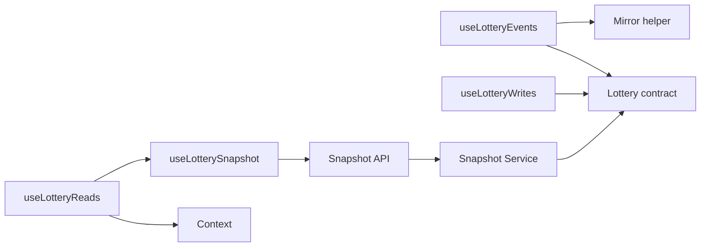

# web/src/hooks — directory audit

This report describes every file in the [`web/src/hooks:1`](web/src/hooks:1) directory and how it interacts with the on-chain contract [`chain/contracts/Lottery.sol:1`](chain/contracts/Lottery.sol:1).

Directory-level interaction diagram:

Interaction path (click to open files):
- [`web/src/hooks/useLotterySnapshot.ts:1`](web/src/hooks/useLotterySnapshot.ts:1) -> [`web/src/app/api/snapshot/route.ts:1`](web/src/app/api/snapshot/route.ts:1) -> [`web/src/server/snapshot/service.ts:1`](web/src/server/snapshot/service.ts:1) -> [`chain/contracts/Lottery.sol:1`](chain/contracts/Lottery.sol:1)
- [`web/src/hooks/useLotteryEvents.ts:1`](web/src/hooks/useLotteryEvents.ts:1) -> [`web/src/lib/mirror.ts:1`](web/src/lib/mirror.ts:1) -> [`chain/contracts/Lottery.sol:1`](chain/contracts/Lottery.sol:1)
- [`web/src/hooks/useLotteryWrites.ts:1`](web/src/hooks/useLotteryWrites.ts:1) calls contract methods (enter, triggerDraw) via wagmi/viem using [`web/src/lib/contracts/lottery.ts:1`](web/src/lib/contracts/lottery.ts:1)
- [`web/src/hooks/useLotteryReads.ts:1`](web/src/hooks/useLotteryReads.ts:1) is a thin adapter over [`web/src/context/LotteryDataContext.tsx:1`](web/src/context/LotteryDataContext.tsx:1) and the server snapshot.

Files

- [`web/src/hooks/useLotterySnapshot.ts:1`](web/src/hooks/useLotterySnapshot.ts:1)
  - Purpose: Client-side hook that polls the server snapshot endpoint (`/api/snapshot`) and provides a parsed, change-only, merged snapshot object to the UI.
  - Why it's here: Centralizes server-driven state for the UI, implements ETag/304 handling, modest polling (2s), dedupe/throttle, and a deterministic merge strategy so components receive stable, minimal updates.
  - Interaction with Lottery.sol: Indirect — relies on the server route [`web/src/app/api/snapshot/route.ts:1`](web/src/app/api/snapshot/route.ts:1) and service [`web/src/server/snapshot/service.ts:1`](web/src/server/snapshot/service.ts:1) which perform the on-chain multicall and Mirror aggregation against [`chain/contracts/Lottery.sol:1`](chain/contracts/Lottery.sol:1).
  - Notes: Parses bigints in "bn:<decimal>" form, respects headers `ETag`, `x-snapshot-hash`, `x-layout-hash`, `x-segments-hash`, `x-snapshot-stale`, and merges with `lastGoodRef` to avoid regressions across transient errors.

- [`web/src/hooks/useLotteryReads.ts:1`](web/src/hooks/useLotteryReads.ts:1)
  - Purpose: Thin client adapter over the snapshot context that formats and derives UI-friendly values (HBAR numbers, progress %, fee/prize previews) without performing RPCs.
  - Why it's here: Provides a single, stable API for components to consume snapshot data (e.g., remaining to target, fee/prize previews) and enforces Hedera decimals (8 tinybar decimals) consistently.
  - Interaction with Lottery.sol: Indirect — reads fields produced from on-chain reads (POOL_TARGET, pendingRefundsTotal, debugUnits, participantCount) via the snapshot; converts tinybar bigints to human-readable HBAR using 8 decimals.

- [`web/src/hooks/useLotteryEvents.ts:1`](web/src/hooks/useLotteryEvents.ts:1)
  - Purpose: Optional client-side listener that subscribes to live contract events via wagmi/viem (`watchContractEvent`) and maps logs into the FeedEntry shape used by the EventsProvider/ActivityFeed.
  - Why it's here: Enables realtime UI updates for new EnteredPool, OverageRefunded, and WinnerPicked events when a public client is available.
  - Interaction with Lottery.sol: Direct subscription to events emitted by [`chain/contracts/Lottery.sol:1`](chain/contracts/Lottery.sol:1), importing ABI/address from [`web/src/lib/contracts/lottery.ts:1`](web/src/lib/contracts/lottery.ts:1) and using helpers like `safeNumber` from [`web/src/lib/mirror.ts:1`](web/src/lib/mirror.ts:1).
  - Notes: This hook performs client-side RPC subscriptions (unlike the snapshot which centralizes reads server-side) — use judiciously to avoid increased RPC load.

- [`web/src/hooks/useLotteryWrites.ts:1`](web/src/hooks/useLotteryWrites.ts:1)
  - Purpose: Exposes write actions to the UI: `useEnterLottery()` to call payable `enter()` and `useLotteryWrites()` to call `triggerDraw()`, both via wagmi's `useWriteContract`.
  - Why it's here: Centralizes transaction construction, signing, and optimistic UI patching (`optimisticEnter` via [`web/src/context/LotteryDataContext.tsx:1`](web/src/context/LotteryDataContext.tsx:1)).
  - Interaction with Lottery.sol: Direct writes to [`chain/contracts/Lottery.sol:1`](chain/contracts/Lottery.sol:1) through `writeContractAsync` and the `LOTTERY_ABI`/`LOTTERY_ADDRESS` exports.
  - Notes:
    - `enter()` normalizes user input and uses `parseEther(normalized)` (18-decimal wei) to produce a bigint `value` sent with the transaction; code comments say "Send values as 18-decimal wei so HashPack/RPC relays accept them." Be aware the contract uses Hedera tinybars (8 decimals); ensure the RPC/relayer correctly maps units.
    - The write hooks validate `LOTTERY_ADDRESS` (must be 0x EVM hex, not Hedera `0.0.x`) before sending.

Directory notes

- The architecture intentionally centralizes reads and event aggregation on the server (`/api/snapshot` + snapshot service) to reduce client RPCs and ensure consistent, deduplicated state; `useLotterySnapshot` is the UI's primary source of truth.
- Writes are performed from the client via wagmi/viem hooks in [`web/src/hooks/useLotteryWrites.ts:1`](web/src/hooks/useLotteryWrites.ts:1); UI components call these hooks and rely on optimistic patches to preserve responsiveness.
- A lightweight client subscription hook (`useLotteryEvents.ts:1`) exists for realtime UI but is optional and performs direct contract event watches when used.

Potential issues & observations

- Unit mapping: the client uses `parseEther` (18 decimals) for the payable `enter()` call while the contract and snapshot semantics use 8-decimal tinybars. Confirm the RPC/relayer performs the expected mapping to avoid amount mismatches.
- `useLotterySnapshot` intentionally omits user-specific pending refunds (`pendingRefundUserWei` is not populated server-side) to keep snapshot calls cheap; the UI approximates user pending refunds via other signals.
- Optimistic patches (`optimisticEnter`) approximate tinybars with `BigInt(Math.floor(amount * 1e8))` — this is an approximation and should be treated as ephemeral UI only.

End of report.