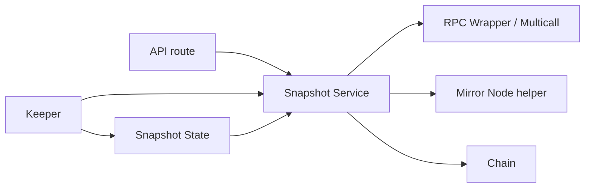

# web/src/server — directory audit

This report describes every file in the [`web/src/server:1`](web/src/server:1) directory and how it interacts with the on-chain contract [`chain/contracts/Lottery.sol:1`](chain/contracts/Lottery.sol:1).

Directory-level interaction diagram:

Files

- [`web/src/server/keeper.ts:1`](web/src/server/keeper.ts:1)
  - Purpose: Minimal server-side keeper that can auto-trigger the `triggerDraw()` action near reveal time using a configured admin private key.
  - Why it's here: Automates draws when the server-observed landing plan reaches the reveal window so operators need not manually trigger draws.
  - Interaction with Lottery.sol: Direct write — calls `triggerDraw()` on the deployed contract (`LOTTERY_ABI`/`LOTTERY_ADDRESS`) using a server wallet (private key from env). Reads snapshot state from [`web/src/server/snapshotState.ts:1`](web/src/server/snapshotState.ts:1).

- [`web/src/server/rpc.ts:1`](web/src/server/rpc.ts:1)
  - Purpose: Exposes a shared `rpcClient` (re-exported from [`web/src/lib/wagmi.ts:1`](web/src/lib/wagmi.ts:1)), telemetry recording helpers, and per-IP token buckets for rate-limiting.
  - Why it's here: Centralizes RPC telemetry and rate-limiting and provides wrappers used by the snapshot service to call multicall with telemetry.
  - Interaction with Lottery.sol: Indirect — used by the snapshot service to perform multicall reads against the contract; does not contain contract-specific logic.

- [`web/src/server/snapshotState.ts:1`](web/src/server/snapshotState.ts:1)
  - Purpose: Small in-memory holder for the latest snapshot (lastGood) so the route and keeper can share state without import cycles.
  - Why it's here: Lightweight cross-module shared state to avoid reading from disk or re-computing the snapshot.
  - Interaction with Lottery.sol: Indirect — holds the canonical snapshot assembled from on-chain reads and Mirror events.

- [`web/src/server/snapshot/service.ts:1`](web/src/server/snapshot/service.ts:1)
  - Purpose: Core orchestration for building the canonical snapshot. Performs multicall on the Lottery contract, fetches Mirror logs, computes canonical segments/layout, spin sessions, ETag/hash, and returns BuildResult used by the API route.
  - Why it's here: Consolidates on-chain reads, Mirror history parsing, deterministic layout math, and caching/single-flight to provide a consistent snapshot to clients.
  - Interaction with Lottery.sol: Primary server-side integration — reads contract functions (owner, isReadyForDraw, isDrawing, participantCount, stage, pendingRefundsTotal, POOL_TARGET, debugUnits, roundId), enumerates `participants[i]` for on-chain backfill, and relies on events (EnteredPool, PoolFilled, WinnerPicked) decoded by [`web/src/lib/mirror.ts:1`](web/src/lib/mirror.ts:1). Uses multicall where supported and falls back to individual reads otherwise.

- [`web/src/server/snapshot/compute.ts:1`](web/src/server/snapshot/compute.ts:1)
  - Purpose: Pure, deterministic math for building wheel segments, canonical normalized segments, entry aggregation, freeze logic, and spin landing plan computation.
  - Why it's here: Keeps deterministic rendering and spin timing logic server-side so clients render the same wheel and landing plan.
  - Interaction with Lottery.sol: Indirect — consumes decoded Mirror entries and aggregated on-chain totals to compute client-visible layout and timing, but contains no RPCs.

- [`web/src/server/snapshot/hash.ts:1`](web/src/server/snapshot/hash.ts:1)
  - Purpose: Canonical JSON serialization, hashing functions, and ETag computation used to determine change-only updates for snapshots.
  - Why it's here: Ensures stable, deterministic snapshot hashing for efficient client caching and 304 semantics.
  - Interaction with Lottery.sol: Indirect — operates on the canonical JSON derived from on-chain state and events.

- [`web/src/server/snapshot/types.ts:1`](web/src/server/snapshot/types.ts:1)
  - Purpose: Type definitions for RawSnapshot, CanonicalSnapshotJSON, Spin types, and BuildResult used across the snapshot service and route.
  - Why it's here: Shared typings to ensure consistent shape between service and consumers.
  - Interaction with Lottery.sol: Indirect — defines the JSON-safe contract of data produced from on-chain reads/events.

- [`web/src/server/snapshot/telemetry.ts:1`](web/src/server/snapshot/telemetry.ts:1)
  - Purpose: Aggregates route/service latency metrics per-minute and provides outlier detection used by the snapshot route to log and warn on high-latency builds.
  - Why it's here: Operational visibility and performance monitoring for snapshot builds.
  - Interaction with Lottery.sol: Indirect — used to instrument the server reads that query the contract.

Directory notes

- The server directory centralizes authoritative, rate-limited reads of the Lottery contract and Mirror history. The snapshot service is the single source of truth for clients; the route (`/api/snapshot`) and `useLotterySnapshot` hook both rely on it.
- The keeper automates draws but only when a server wallet key is configured; ensure `LOTTERY_ADMIN_PRIVATE_KEY` or equivalent is present and protected.
- Telemetry and token buckets exist to prevent abusive rebuild triggers and to maintain stable service behavior when Mirror or RPC are degraded.

End of report.