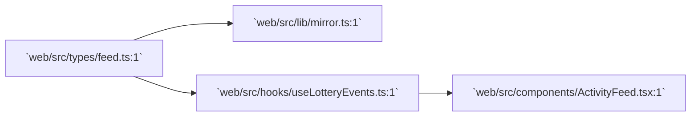

# web/src/types — directory audit

This report describes every file in the [`web/src/types:1`](web/src/types:1) directory and how it interacts with the on-chain contract [`chain/contracts/Lottery.sol:1`](chain/contracts/Lottery.sol:1).

Directory-level interaction diagram:

Files

- [`web/src/types/feed.ts:1`](web/src/types/feed.ts:1)
  - Purpose: Defines the `FeedEntry` and related type aliases used to represent decoded on-chain events and their metadata (txHash, logIndex, blockNumber, timestamp, participant, winner, amounts).
  - Why it's here: Provides a canonical, portable shape for event entries produced by [`web/src/lib/mirror.ts:1`](web/src/lib/mirror.ts:1), consumed by the EventsProvider and UI components (ActivityFeed), and used across server/client code for type safety.
  - Interaction with Lottery.sol: Direct mapping — the type models events emitted by the contract (EnteredPool, OverageRefunded, WinnerPicked). Amount fields represent tinybar values (bigint or number) as decoded from logs and then formatted for UI.

Directory notes

- Keep this type stable; changes to the ABI/event shapes in [`chain/contracts/Lottery.sol:1`](chain/contracts/Lottery.sol:1) should be reflected here and in `mirror.ts` decoding logic to avoid runtime mismatches.